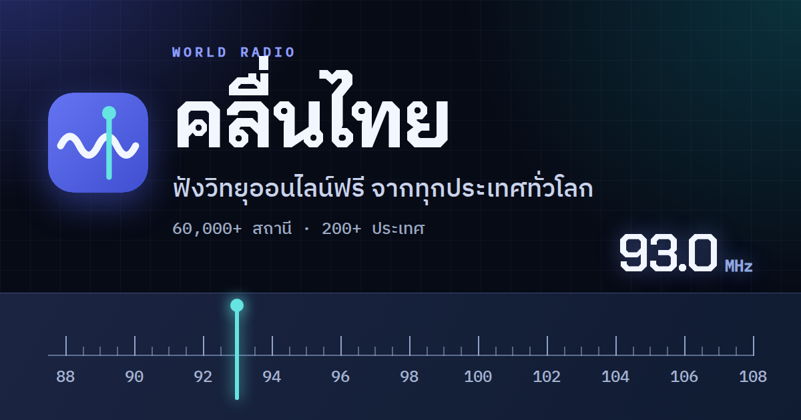

# คลื่นไทย

เว็บฟังวิทยุออนไลน์ฟรีจากทุกประเทศทั่วโลก ข้อมูลสถานีจาก [Radio Browser](https://www.radio-browser.info/)



- สถานีจากกว่า 200 ประเทศ เรียงตามความนิยม แบ่งหน้าละ 30 สถานี
- ตารางธงประเทศ ค้นหาได้ทั้งชื่อไทย ชื่ออังกฤษ และรหัส 2 หลัก (เช่น `jp`, `ญี่ปุ่น`, `japan`)
- หน้าปัด FM 87.5–108 MHz เข็มเลื่อนตามสถานี (อ่านความถี่จากชื่อสถานี)
- ค้นหาสถานี กรองตามแนวเพลง สถานีโปรด และประวัติฟังล่าสุด (เก็บในเครื่อง)
- เล่น HLS ผ่าน hls.js, ปุ่มบนหน้าจอล็อกมือถือ (Media Session), ธีมสว่าง/มืดตามเครื่อง
- ใช้คีย์บอร์ดได้ทุกปุ่ม: `Space` เล่น/หยุด, `←` `→` สถานีก่อนหน้า/ถัดไป
- ลิงก์ตรงไปยังประเทศและหน้าได้ เช่น `#jp/2`, `#fav`, `#recent`
- รีเฟรชได้แม้ออฟไลน์ (service worker ใน production build)
- มี stream proxy (ไม่บังคับ) สำหรับเล่นสตรีม `http://` บนหน้า `https://`

## เริ่มต้นใช้งาน

ต้องใช้ [Node.js](https://nodejs.org/) 20 ขึ้นไป (แนะนำ 24 LTS) และ npm

```bash
git clone https://github.com/<owner>/khlun-thai.git
cd khlun-thai
npm ci
npm run dev
```

เปิด URL ที่ขึ้นในหน้าจอ (ปกติ `http://localhost:5173`)

### คำสั่ง

| คำสั่ง | ทำอะไร |
|---|---|
| `npm run dev` | dev server พร้อม hot reload |
| `npm test` | unit test (Vitest) |
| `npm run build` | build ไฟล์ static ลง `dist/` |
| `npm run preview` | เปิด `dist/` ที่ build แล้ว (ทดสอบ service worker / ออฟไลน์ได้ที่นี่) |

### โครงสร้างโปรเจกต์

```
├── index.html            หน้าเว็บ
├── src/
│   ├── main.js           ประกอบทุก module
│   ├── config.js         ค่าคงที่ (PAGE_SIZE, PROXY_BASE ฯลฯ)
│   ├── api.js            Radio Browser: เลือก mirror, fallback, cache
│   ├── player.js         <audio>, hls.js, Media Session
│   ├── router.js         hash routing
│   ├── store.js          สถานีโปรด, ฟังล่าสุด, ระดับเสียง
│   ├── freq.js           อ่านความถี่ FM จากชื่อสถานี
│   ├── ui/               หน้าปัด, การ์ด, ตัวแบ่งหน้า, ตารางธง, chips, แถบควบคุม
│   └── styles/           CSS tokens (สว่าง/มืด) และ layout
├── public/               favicon, ภาพแชร์, manifest, service worker
├── server/               stream proxy (Node + Fastify) — ไม่บังคับ
├── deploy/               docker compose + nginx
└── docs/                 แผนงาน (PLAN.md, PROXY.md)
```

## การตั้งค่า

ค่าที่ใช้ตอน `npm run build` / `npm run dev` (ตั้งเป็นตัวแปร environment)

| ตัวแปร | ค่าเริ่มต้น | ความหมาย |
|---|---|---|
| `VITE_PROXY_BASE` | `/stream/` | ที่อยู่ของ stream proxy (ดูหัวข้อถัดไป) |
| `BASE_PATH` | `/` | path ที่เว็บอยู่ เช่น `/khlun-thai/` สำหรับ GitHub Pages |
| `SITE_URL` | ไม่ตั้ง | URL เต็มของเว็บที่ deploy แล้ว ใช้ทำ canonical และภาพตอนแชร์ลิงก์ (Facebook, LINE, X ต้องการ URL เต็มของรูป) |
| `VITE_PROXY_ALWAYS` | ไม่ตั้ง | `1` = ส่งสตรีม http ผ่าน proxy แม้หน้าเว็บเป็น http (ทดสอบตอน dev) |
| `PROXY_TARGET` | `http://localhost:3000` | ปลายทางที่ `npm run dev` ส่ง `/stream` ต่อไปให้ |

ค่าอื่นๆ เช่นจำนวนสถานีต่อหน้าและอายุ cache อยู่ใน [`src/config.js`](src/config.js)

### PROXY_BASE

หน้าเว็บที่เปิดผ่าน https เล่นสตรีม `http://` ตรงๆ ไม่ได้ (เบราว์เซอร์บล็อก mixed content) จึงต้องผ่าน stream proxy:

- **มี proxy** (deploy ด้วย docker compose): ใช้ค่าเริ่มต้น `/stream/` — สถานี http เล่นผ่าน `/stream/<stationuuid>`
- **proxy อยู่คนละโดเมน**: `VITE_PROXY_BASE=https://stream.example.com/stream/ npm run build`
- **ไม่มี proxy** (เช่น GitHub Pages): `VITE_PROXY_BASE= npm run build` — การ์ดสถานี http จะแสดงแบบจางและบอกสาเหตุเมื่อกด ส่วนสถานี https และ HLS เล่นได้ตามปกติ

ตอนเปิดผ่าน `http://` (เช่น `npm run dev`) ไม่มีปัญหา mixed content สถานี http จึงเล่นตรงจากสถานีได้เลย

## Deploy

### GitHub Pages (ไม่มี proxy)

1. push repo ขึ้น GitHub ชื่อ `khlun-thai`
2. Settings → Pages → Build and deployment → Source: **GitHub Actions**
3. push ขึ้น branch `main` (หรือกด Run workflow ที่ Actions → Deploy to GitHub Pages)
4. เว็บอยู่ที่ `https://<owner>.github.io/khlun-thai/`

workflow [`.github/workflows/pages.yml`](.github/workflows/pages.yml) ตั้ง `BASE_PATH` และ `SITE_URL` ตามชื่อ repo ให้อัตโนมัติ และตั้ง `VITE_PROXY_BASE` เป็นค่าว่าง ถ้าเปลี่ยนชื่อ repo ไม่ต้องแก้อะไร

ทุก push และ pull request จะรัน test และ build ผ่าน [`.github/workflows/ci.yml`](.github/workflows/ci.yml) (ทั้งหน้าเว็บและ proxy)

### Docker (มี proxy)

หน้าเว็บ + stream proxy บนเซิร์ฟเวอร์ของตัวเอง ดูวิธีรันในหัวข้อ [รันด้วย docker compose](#รันด้วย-docker-compose) ด้านล่าง
ให้วาง reverse proxy ที่ทำ https (เช่น Caddy, Cloudflare Tunnel) ไว้หน้า port `8080` แล้ว build หน้าเว็บด้วย `SITE_URL=https://radio.example.com/`

## Stream proxy

สตรีมวิทยุจำนวนมากเป็น `http://` เมื่อหน้าเว็บเปิดผ่าน `https://` เบราว์เซอร์จะบล็อก (mixed content)
proxy ใน [`server/`](server/) รับแค่ `stationuuid` แล้วไปหา URL จริงจาก Radio Browser เอง จากนั้นส่งเสียงกลับผ่าน https ของเรา
รายละเอียดการออกแบบอยู่ที่ [docs/PROXY.md](docs/PROXY.md)

```
เบราว์เซอร์ ──https──▶ Nginx ──▶ proxy (Node) ──lookup──▶ Radio Browser API
                                      │
                                      └──http──▶ เซิร์ฟเวอร์สตรีมของสถานี
```

- `GET /stream/:uuid` ส่งเสียง, `HEAD /stream/:uuid` ตรวจว่าเล่นได้ไหม (ไม่ต่อสถานี), `GET /healthz` สถานะ
- **ไม่มี endpoint หรือ parameter ใดรับ URL จากผู้ใช้** — ปลายทางทุกตัว (รวม redirect และ URL ใน playlist) ต้องผ่านการตรวจ: เฉพาะ http/https, port 80/443/1024–65535, ห้าม IP ภายในทุกช่วง และเชื่อมต่อไปยัง IP ที่ตรวจแล้วเท่านั้น (กัน DNS rebinding)
- รองรับ SHOUTcast ที่ตอบ `ICY 200 OK`, playlist `.pls`/`.m3u` และ redirect ไม่เกิน 5 ครั้ง ยังไม่รองรับ HLS (ตอบ `415`)

### ค่า config (env ของ proxy)

คัดลอก [`server/.env.example`](server/.env.example) เป็น `server/.env` แล้วแก้ (ห้าม commit `server/.env`) ทุกค่ามีค่าเริ่มต้น

| ตัวแปร | ค่าเริ่มต้น | ความหมาย |
|---|---|---|
| `PORT` | `3000` | port ที่ proxy ฟัง |
| `ALLOWED_ORIGIN` | `http://localhost:5173` | ค่า `Access-Control-Allow-Origin` — ใส่ origin ของหน้าเว็บจริงตอน deploy เช่น `https://radio.example.com` |
| `TRUSTED_PROXY` | `127.0.0.1` | IP/CIDR ของ Nginx ที่อนุญาตให้เชื่อ `X-Forwarded-For` (คั่นด้วยจุลภาคได้) — ใน docker compose ตั้งให้อัตโนมัติ |
| `MAX_STREAMS` | `200` | สตรีมพร้อมกันสูงสุดทั้งระบบ (เกิน → `503`) |
| `MAX_STREAMS_PER_IP` | `3` | สตรีมพร้อมกันสูงสุดต่อ IP (เกิน → `429`) |
| `RATE_LIMIT_PER_MIN` | `30` | จำนวนครั้งที่เปิด `/stream` ได้ต่อ IP ต่อนาที (เกิน → `429`) |
| `LOOKUP_TTL_SEC` | `600` | อายุ cache ผล lookup uuid → URL (วินาที) |
| `CONNECT_TIMEOUT_MS` | `8000` | timeout ตอนเชื่อมต่อสถานี |
| `HEADER_TIMEOUT_MS` | `10000` | timeout รอ header จากสถานี |
| `IDLE_TIMEOUT_MS` | `30000` | ตัดสตรีมถ้าไม่มีข้อมูลเข้ามานานเกินนี้ |
| `RB_USER_AGENT` | `khlun-thai-proxy/1.0` | User-Agent ที่ใช้คุยกับ Radio Browser |

ค่าผิดรูปแบบ proxy จะไม่ยอมเริ่มทำงานและบอกทุกตัวที่ผิด

ค่าฝั่งหน้าเว็บ (`VITE_PROXY_BASE`, `VITE_PROXY_ALWAYS`, `PROXY_TARGET`) อยู่ในหัวข้อ [การตั้งค่า](#การตั้งค่า)

### รันบนเครื่องตัวเอง

ต้องใช้ Node.js 20 ขึ้นไป

```bash
# terminal 1: proxy (ในโฟลเดอร์ server/)
cd server
npm install
npm test
npm start                      # ฟังที่ :3000 (ถ้า port ไม่ว่าง: PORT=3010 npm start)

# terminal 2: หน้าเว็บ — ที่โฟลเดอร์หลักของโปรเจกต์ ไม่ใช่ server/
# (npm run dev ใน server/ คือ proxy แบบ watch ไม่ใช่หน้าเว็บ)
VITE_PROXY_ALWAYS=1 npm run dev                                  # proxy ที่ :3000
VITE_PROXY_ALWAYS=1 PROXY_TARGET=http://localhost:3010 npm run dev  # proxy ที่ port อื่น
```

ลองตรงๆ ด้วย curl:

```bash
curl -s localhost:3000/healthz
curl -s localhost:3000/stream/<stationuuid> --max-time 5 -o test.mp3; file test.mp3
```

### รันด้วย docker compose

```bash
npm ci && npm run build                                  # สร้าง dist/ ของหน้าเว็บ
cp server/.env.example server/.env                       # แก้ ALLOWED_ORIGIN ฯลฯ (ไม่มีไฟล์นี้ก็ใช้ค่าเริ่มต้น)
docker compose -f deploy/docker-compose.yml up --build -d
```

- เปิด `http://localhost:8080` (port ไม่ว่าง: `WEB_PORT=8090 docker compose -f deploy/docker-compose.yml up --build -d`)
- service `web` (nginx) เสิร์ฟ `dist/` และส่ง `/stream/` ต่อให้ service `proxy` ซึ่งไม่เปิด port ออกนอก
- `/healthz` เข้าได้เฉพาะจากในเครื่อง: `docker compose -f deploy/docker-compose.yml exec proxy wget -qO- http://127.0.0.1:3000/healthz`
- ดู log: `docker compose -f deploy/docker-compose.yml logs -f proxy` (หนึ่งบรรทัดต่อสตรีม, IP ถูกตัดเป็น /24 หรือ /48, ไม่มี URL เต็ม)
- image ใช้ Node 24 LTS เป็นค่าเริ่มต้น (`--build-arg NODE_VERSION=22` เพื่อเปลี่ยน)

เมื่อวาง reverse proxy อีกชั้นไว้หน้า nginx (เช่น Cloudflare Tunnel, Caddy) nginx จะเห็น IP ของตัวกลางแทนผู้ใช้ และทุกคนจะใช้โควตา `MAX_STREAMS_PER_IP` ร่วมกัน ให้เปิดส่วน `real_ip` ใน [`deploy/nginx.conf`](deploy/nginx.conf) และใส่ IP ของตัวกลาง

### ข้อความ error บนหน้าเว็บ

`<audio>` อ่านรหัส HTTP ไม่ได้ เมื่อเล่นไม่สำเร็จหน้าเว็บจะเรียก `HEAD /stream/:uuid` เพื่ออ่านรหัสแล้วแสดง:

| รหัสจาก proxy | ข้อความ |
|---|---|
| `429`, `503` | เซิร์ฟเวอร์เต็มชั่วคราว ลองใหม่อีกครั้ง |
| `415` | สถานีนี้ยังเล่นผ่าน proxy ไม่ได้ |
| `403`, `404`, `502`, `504` | สถานีออฟไลน์ ลองสถานีอื่น |

### ประเมิน bandwidth

- สตรีม 128 kbps = 16 KB/วินาที ≈ **58 MB ต่อผู้ฟัง 1 คนต่อชั่วโมง**
- ผู้ฟังพร้อมกัน 50 คน ≈ **6.4 Mbps ต่อเนื่อง** (ขาออก) และขาเข้าจากสถานีเท่ากัน
- ถ้าฟังพร้อมกัน 50 คนตลอด 24 ชั่วโมง ≈ 2.1 TB ต่อเดือนต่อทิศทาง — ตรวจโควตา bandwidth ของ VPS ก่อน และปรับ `MAX_STREAMS` ให้เหมาะ
- proxy ส่งต่อเฉพาะสตรีม http เท่านั้น สตรีม https และ HLS หน้าเว็บเล่นตรงจากสถานี ไม่ผ่านเซิร์ฟเวอร์เรา

### ถ้าใช้ Cloudflare

ให้ subdomain ที่เสิร์ฟ `/stream` เป็นแบบ **DNS-only (เมฆสีเทา)** เพราะเงื่อนไขแผนฟรีของ Cloudflare จำกัดการส่งสื่อปริมาณมากผ่าน proxy ของ Cloudflare
ถ้าแยก proxy ไปไว้คนละ subdomain กับหน้าเว็บ ให้ build หน้าเว็บด้วย `VITE_PROXY_BASE=https://stream.example.com/stream/` และตั้ง `ALLOWED_ORIGIN` ของ proxy เป็น origin ของหน้าเว็บ

### หมายเหตุลิขสิทธิ์

proxy ส่งต่อสตรีมให้ผู้ใช้ที่กดฟังแต่ละคนเท่านั้น ไม่ได้อัด เก็บ หรือออกอากาศซ้ำ ลิขสิทธิ์เนื้อหาเป็นของแต่ละสถานี

## เครดิต

- ข้อมูลสถานีจาก [Radio Browser](https://www.radio-browser.info/) — ฐานข้อมูลสถานีวิทยุแบบเปิด ทุกครั้งที่กดเล่น หน้าเว็บเรียก `/json/url/{stationuuid}` เพื่อนับยอดคลิกให้สถานีตามที่ Radio Browser ขอ
- ธงประเทศ: [flag-icons](https://github.com/lipis/flag-icons) (MIT)
- เล่น HLS: [hls.js](https://github.com/video-dev/hls.js) (Apache-2.0)
- ฟอนต์: Chakra Petch, IBM Plex Sans Thai, IBM Plex Mono จาก Google Fonts (SIL Open Font License)

## ลิขสิทธิ์

- โค้ดของโปรเจกต์นี้ใช้สัญญาอนุญาต [MIT](LICENSE)
- เนื้อหาเสียง ชื่อ และโลโก้ของสถานีเป็นลิขสิทธิ์ของแต่ละสถานี โปรเจกต์นี้ลิงก์ไปยังสตรีมสาธารณะที่สถานีเผยแพร่เองเท่านั้น ไม่ได้เก็บ อัด หรือเผยแพร่เนื้อหาซ้ำ
